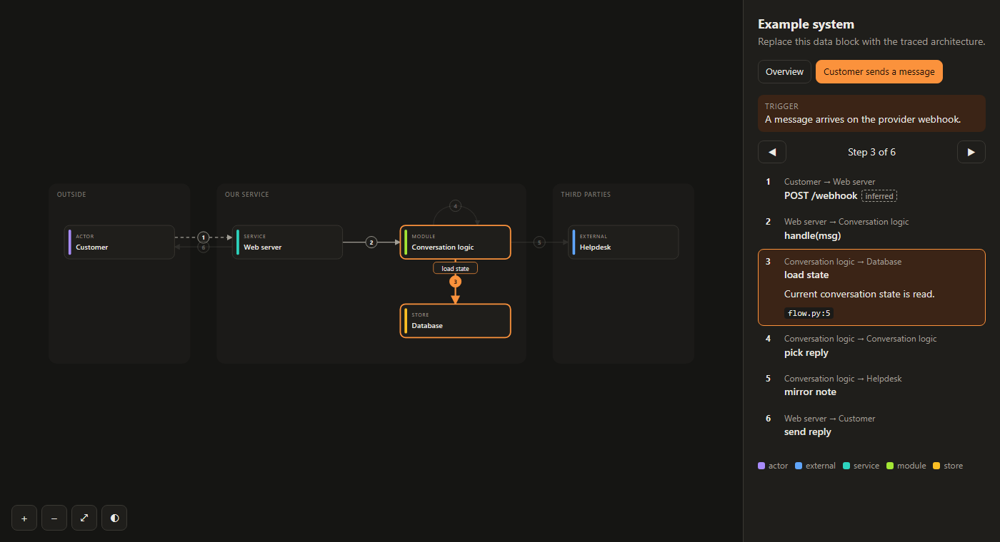
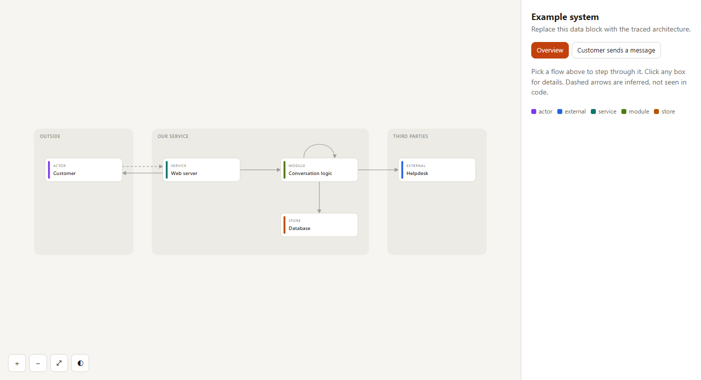

# skills

Agent skills I've built during development. They follow the [Agent Skills](https://agentskills.io) `SKILL.md` format and work in Claude Code, claude.ai, OpenCode, and other compatible agents.

## Install

```bash
npx skills add AJ-72/skills
```

## Skills

| Skill | What it does |
|-------|--------------|
| [architecture-canvas](skills/architecture-canvas/SKILL.md) | Traces how events flow through a codebase (web services, JSP/.NET monoliths, Godot/Unity games) and renders a zoomable, pannable canvas you can step through flow by flow. Each arrow cites the `file:line` it was traced from, and a validator checks that those references exist. |

---

## architecture-canvas

Use this when you've lost track of how a codebase fits together. The skill follows real events through the code ("customer sends a message", "user clicks pay", "player presses jump") and draws each one as an interactive diagram you can zoom, pan, and step through.


*Stepping through "Customer sends a message", dark theme. Step 3 is highlighted on the map and shows the `file:line` it was traced from. Step 1 is dashed because that hop is configured outside the code, so it's marked inferred.*

<details>
<summary>Overview mode (light theme)</summary>



</details>

*Both screenshots show the template's built-in example data. A real run replaces it with the components and flows traced from your repo.*

### How to use

Ask in plain language, for example:

- *"Map what happens when a customer sends a WhatsApp message."*
- *"Show me the architecture of this app."*
- *"What happens end to end when a payment webhook fires?"*

The skill loads automatically when the request fits. In Claude Code you can also run `/architecture-canvas`.

### What it does

1. **Picks the flows.** A flow is one trigger event followed to its end. If you only name a system, the skill finds its entry points (routes, webhooks, handlers, cron jobs, queue consumers) and picks the 3–6 that carry the core business, including the reply paths.
2. **Traces each flow hop by hop.** This covers calls between modules, outbound API calls, database reads and writes, queues, callbacks, and the branches that change where things go. Each step cites the `file:line` where it happens. A hop that can't be seen in the code (for example a webhook URL set in a vendor dashboard) is drawn as a **dashed** arrow, and the step says what the inference is based on.
3. **Builds the canvas** from a self-contained HTML template: no build step, and no dependencies besides the browser.
4. **Validates it.** `validate.py` fails on unknown node ids, two nodes in the same grid cell, and `file:line` references that don't exist in the repo. The canvas isn't handed over until it prints `OK`.
5. **Saves it** to `docs/architecture/<name>.html` in your repo, so the next run refreshes the existing canvas against current code instead of starting over.

### Canvas controls

| Action | Control |
|--------|---------|
| Pan | Drag |
| Zoom | Scroll wheel or pinch |
| Choose a flow | Flow picker |
| Step through a flow | ← / → |
| Fit to screen | `F` |
| Component details | Click a node (shows what it owns and where its code lives) |

The canvas works in light and dark mode and on phones.

### Supported stacks

The trace works on any language. The skill also lists where each of these stacks hides its wiring in config or editor files, so that hops declared there are cited instead of guessed:

- **Web services and bots:** route tables, webhook handlers, SDK clients, `.env.example`, docker-compose.
- **Java / JSP:** `web.xml`, `struts-config.xml`, Spring XML and annotations, JNDI datasources.
- **.NET:** DI and middleware in `Program.cs`/`Startup.cs`, route attributes, `Global.asax`, `web.config`/`appsettings.json`, EF `DbContext`.
- **Stored procedures:** looks for the SQL in the repo; if it isn't there, the hop is marked inferred.
- **Godot:** `[connection]` lines in `.tscn`, autoloads in `project.godot`, signals, and groups.
- **Unity:** `UnityEvent`s wired in the Inspector (found by matching script GUIDs to `.meta` files), ScriptableObject event channels, and event buses.

Monoliths are drawn as layers (controller → service → DAO → database). Games are drawn as subsystems laid out input → logic → physics → presentation → persistence.

### How it differs from archify

[archify](https://www.skills.sh/tt-a1i/archify/archify) is a mature, general-purpose diagramming skill. It has five diagram types (architecture, workflow, sequence, dataflow, lifecycle), accepts Mermaid input, works for non-technical subjects too, and exports PNG/SVG/WebM. It also cites source evidence for a repo, pinned to a commit. If you want polished, exportable diagrams of anything, use archify.

architecture-canvas does one narrower job: **"what happens, hop by hop, when X occurs in this codebase?"**

| | architecture-canvas | archify |
|---|---|---|
| Main question | How does an event travel through *this* code? | Any diagram: systems, processes, pipelines, states, everyday plans |
| Shape of output | **One component map with several flows layered on it.** Pick a flow and step through it with ←/→ | One diagram per request, choosing one of 5 types |
| Reading a flow | Step panel: what happens, why it matters, `file:line`, with the hop highlighted on the map | Relationships and labels on the diagram, with optional trace animation |
| Unseen hops | Drawn **dashed** and labelled `inferred`, with what the guess rests on | Recorded as explicit unknowns next to the claim |
| Staying current | Saves to `docs/architecture/` and **refreshes in place** on the next run, keeping node ids stable, so changes show up in git diffs | Each request gets a new timestamped `.archify/` folder, so earlier versions are kept |
| Stack guidance | Lists where wiring hides in JSP/.NET config, stored procedures, Godot `.tscn`, Unity YAML/GUIDs | General repository-tracing guidance |
| Footprint | 3 files: `SKILL.md`, an HTML template, a ~130-line Python validator (standard library only) | Node.js CLI with schemas, references, browser checks and exports |
| Evidence check | Validator checks refs against the working tree, including uncommitted changes | Evidence verified against the pinned commit |
| Exports and themes | Light and dark themes, plus the HTML file itself | Light and dark themes, PNG/JPEG/WebP/SVG/WebM |

Because it's small, it's cheap to run and easy for smaller models to follow (for example Gemini Flash or GLM in OpenCode). It's also easy to fork for your own stack.

### Requirements

- An agent that supports `SKILL.md` and can read files and run shell commands (Claude Code, OpenCode, and others). On claude.ai with pasted code, the validator runs without repo reference checks.
- Python 3 for `validate.py` (standard library only).

### Files

| File | Purpose |
|------|---------|
| `SKILL.md` | Instructions the agent follows |
| `canvas-template.html` | Canvas renderer; the agent fills in its JSON data block (the schema is in its header comment) |
| `validate.py` | `python validate.py <canvas.html> --root <repo>`: checks node ids, layout, and code references |

### Tips

- With smaller or faster models, spot-check a few `file:line` references. The validator confirms a line exists, not that it's the right line.
- Re-run the same request after big changes. It refreshes the existing canvas and keeps the node ids stable.
